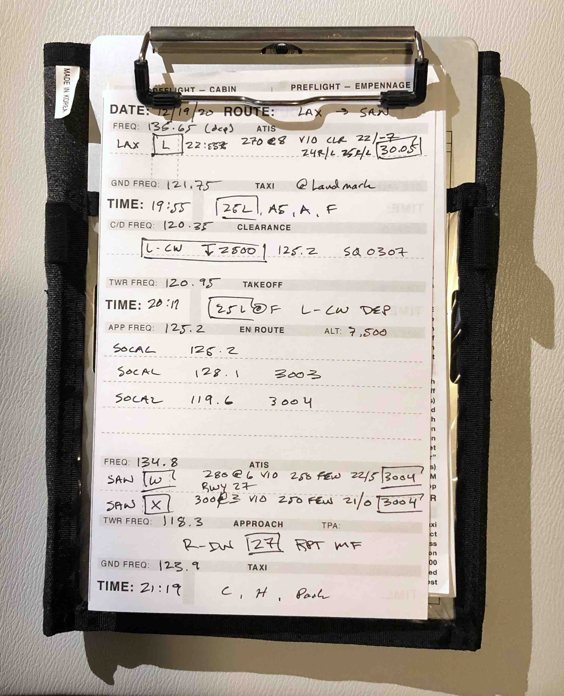

# Kneeboard
A collection of aircraft checklists, templates and documents used before, during and after flight.

## Cessna C172M Checklist
This checklist has been optimized over numerous sorties. It borrows the best elements from multiple popular C172M checklists, and includes key elements of [AQP](https://flightchops.com/grassroots/) integrated throughout.

## In-Flight Notes Template
My version of a popular kneeboard-sized note-taking template you'll find for sale on the Internet.

Example of use:

## macOS Print Settings and Folding Instructions
The PDFs are designed to print on standard 8" x 11" paper. The following are the ideal macOS print settings (Window should have similar options):
* Two-Sided: checked
* Black & White: checked
* Scale: 100%
* Quality: Best
* Layout: Two-Sided, Short-Edge binding

And here's how you fold them:

# Bugs

If you find an error, please submit an issue.

# Contributions

Contributions are welcome!

# License
GNU GPLv3